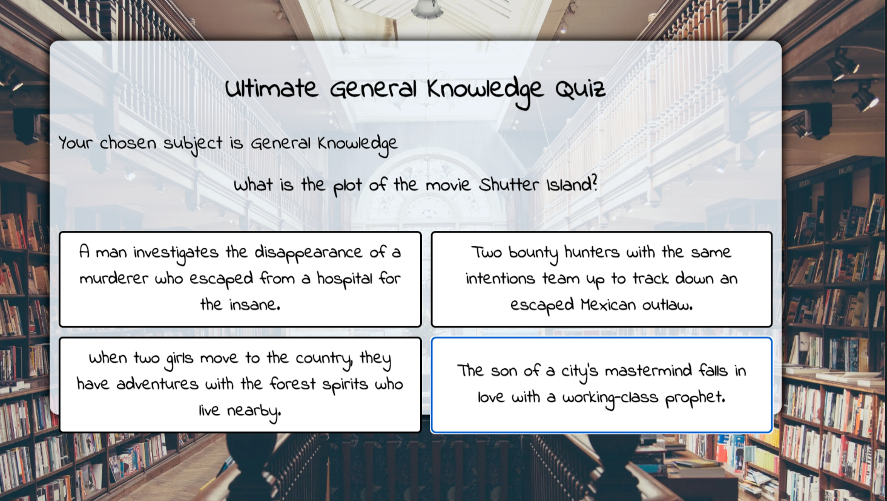

# Ultimate General Knowledge Quiz

This is a website designed for people to test there general knowledge. It has been made to be responsive and accessible on a range of devices. The site is used by people who would like to test their knowledge within a quiz setting.

[View the website here on GitHub Pages](https://gorarth.github.io/UltimateGeneralKnowledgeQuiz/) Right click to open in new page.
- - - 

## Contents

- [Initial Discussion](#initial-discussion)
    - [Key Information about the website](#key-information-about-the-website)
    - [User Stories](#user-stories)
- [Design](#design)
- [Wireframes](#wireframes)
- [Tech](#tech)
- [Additonal Programs Used](#additional-programs-used)
- [Features](#features)
    - [Existing Features](#existing-features)
   
    - [Future Features](#future-features)
       
- [Deployment](#deployment)
- [Testing](#testing)
    - [User Story Testing](#user-story-testing)
    - [Manual Testing](#manual-testing)
    - [Validator Testing](#validator-testing)
    - [Solved Bugs](#solved-bugs)
    - [Known Bugs](#known-bugs)
    - [Lighthouse Tests](#lighthouse)
- [Credits](#credits)
- - - 

## Initial Discussion

Ultimate General Knowledge Quiz is an online website, focused on using JavaScript to output an ever-changing quiz. Users will be able to access the quiz with ease and start at the click of a button. Each question will be randomly selected from an API and therefore will constantly test there knowledge and not be the same questions each time.

### Key Information about the website

- Quiz with multiple categorys to choose from, so users don't have to stick to one theme.

- The questions are taken from an API so the questions will often be very different.

## User Stories

- First time visistors will be able to easily navigate the page with a simple format and click the desired category and play the quiz.

- Returning visitors will be able to choose different categorys of questions which are more specific then general knowledge.

- Frequent users will want to be able to keep track of there highscores and challenge themselves to do better each time they come to the quiz.

[Back to Contents](#contents)
- - - 

## Design

- All text has been kept as standard black to help with legibility, with the buttons keeping a solid background of white so they text doesn't get lost within the background images.

- The images used change depending on the category and are themed towards that category. for example wine and cheese for food and drink, and a sports venue and crowd for the sports category.

- The background of the game area is Alice white, a slight off white with an opacity of 0.8 to give a transparent feel, so people can see the full background picture, while keeping the play area obvious.

- The font used throughout the whole website is Indie Flower, cursive, and most text is in bold. The font is clean and easy to read while giving the quiz a bit of flare.

[Back to Contents](#contents)
- - - 

## Wireframes

- Below is a picture of my wireframes for the quiz.
- Below that is also the wireframes for the mobile version 

[Back to Contents](#contents)
- - - 

## Tech

- This website features interactive elements and is fully responsive on all devices.

- The Languages used to create this website is HTML5, CSS3 and JavaScript.

## Additional Programs Used

- Balsamiq used for creating wireframes.

- GitHub to save and store the files for our site.

- Google Fonts used to import the font used within the website.

- Google Dev Tools was used to help test and troubleshoot any issues.

- Am I Responive used to show the website on a range of devices

- Cloud Converter was used to change all images into a webp format

- Tiny PNG was used to compress the images

- W3schools helped with some coding issues and help with some syntax's.

- Slack was used when i got stuck and asked for help within the coding community.

[Back to Contents](#contents)
- - - 

## Features
### Existing Features

1. #### Landing Page

    - As soon as you land on the webpage, it is clear that it is a quiz. The purpose of the site is clear and easily understood from the moment you enter.

    - It is clear to the users that they can pick which category they desire.

2. #### The Quiz/Game area

    - Once a user has clicked on the category they want to play from the landing page. They will be shown a question.

    - It is clear from the 4 options, that clicking on one will submit that answer.

    - The game will cycle through the questions in the same screen once clicked on, saving the user having to click multiple times to submit an answer.

3. #### End Screen 

    - Once the game has ended, the end screen will display. Clearly showing the user the category they picked, and the score they received.

    - A restart button will appear with a little bit of detail above, telling them to push said button to go back to the main page and play again, if they wish too.

### Future Features 

1. #### Highscores

    - I could implement a highscore feature, which could either save to the users device or a global scale. This option could also compare scores among friends if a feature for creating an account was added, see below.

    - Adding in a timer, to see who completes the quiz in the fastest time would be a second way to see who is top dog. Who can get all 10 right the fastest?

2. #### User Accounts

    - Adding in a person user account would add a lot of replay value and other features along side that.
        
        - Within this feature, You could add your friends to a friend list, and then compare scores with each other and see who can beat who. 

3. #### Endless mode

    - Could add in a mode, in which after answering 10 questions, you can select a new category and keep your current score. 

        - within this mode, you can have highscores at certain break points, or simple who has the most questions answered. Who can get 100/100 questions right first?
        
             

[Back to Contents](#contents)
- - - 

## Deployment

GitHug Pages was used to deploy the website. I did this by
- Log in to GitHub
- Went into my repository
- Clicked on the settings tab
- Find and selected the Pages link in the navigation bar
- In the source section, choose "main" from the drop down branch menu.
- Selected "Root" from the down down folder menu
- Save. Website is now live when highlighted Green.

Forking the GitHub repository:

- Login into GitHub and locate the repository - BBQ Lovin project1
- At the top of repository in right corner locate the "fork" button and click on it.
- Choose where you want to save your forked repository.

[Back to Contents](#contents)
- - -

# Testing

Throughout building this project, I tested everytime i added something new. I used the google dev tools for "score" and "console" a lot. This really helped with the building process and to further expand my knowledge of JavaScript and how everything worked.

## User Story testing

- First time user testing; Easy to navigate and understand the purpose of the webpage. They understand through the short disciption that click on the category, will start the quiz.

- Returning users; They have multiple categorys in which they can pick from, as well as the questions constantly changing through the API.

- Frequent users; They will want more features added in, this will be achieved by implementing the proposed future features, with the likes of highscores and special modes.

## Manual Testing

I have manually tested the webpage on a number of different mobile devices using the google chrome developer tools to make sure they where responsive.

- iPhone 13 Pro
- iPhone 12 Pro
- Pixel 5
- iPhone 8 Plus
- MacBook Pro 13"
- Samsung Galaxy S20 Ultra
- iPad Air
- iPad Mini
- Surface Pro 7
- Samsung Galaxy A51/71

I also tested the webpage on some browsers

- Google Chrome
- Microsoft Edge

## Validator Testing

All HTML, CSS and JavaScript has been passed through a validator with no significant issues.

- [Index HTML](https://validator.w3.org/nu/?doc=https%3A%2F%2Fgorarth.github.io%2FUltimateGeneralKnowledgeQuiz%2F)

- [CSS](https://jigsaw.w3.org/css-validator/validator?uri=https%3A%2F%2Fgorarth.github.io%2FUltimateGeneralKnowledgeQuiz%2F&profile=css3svg&usermedium=all&warning=1&vextwarning=&lang=en)

- JavaScript

## Solved Bugs and Issues

- When i coded in the API, I noticed that the API wasn't gathering the questions and answers into an array within the variable i had put. This was happening due to me not calling the function to work.

- When i first put in the background images, i tried to change them through the JavaScript, so when it was clicked the JavaScript would active another function to change the image. This didn't work and i changed to the simpler method of doing it within the CSS and puting in the JavaScript functions classList.add() to change the background image.

- Due to having a hover effect on the buttons, When using a mobile device, once the user had pressed the answer they wanted, the question and answers would change, but the hover effect would roll over to the next question.

## Known Bugs

- Depending on the screensize and the question size, The Answers may overhang off the game area. This could be fixxed by increasing the Game area size, however this happened very little and rather than having lots of empty space, i opted to have it overhang on that odd occasion.

[Back to Contents](#contents)
- - - 

## Lighthouse

Using Lighthouse found within google chromes developer tools, i tested the performance, accessibilty, best practices and SEO of the website.

- The first photo is of the desktop version
- The second photo is of the mobile version

[Back to Contents](#contents)
 - - -

 ## Credits

[The Trivia API](https://the-trivia-api.com/) Was used to gather all the questions for each category.

[pxhere](https://pxhere.com) Was used for all images.
 

[Back to Contents](#contents)
- - -

## Acknowledgements 

I'd like to thank the people who have helped and assited me on completing my firt project.

- Narender, My mentor
- Kera Cudmore, for helping with the use of JSHint
- Grace McKenna, for helping point out some bugs.
- SuzyBee, for helping with the background image change, and giving the idea to do it in CSS rather than JS
